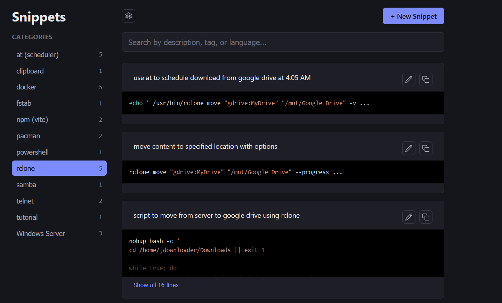
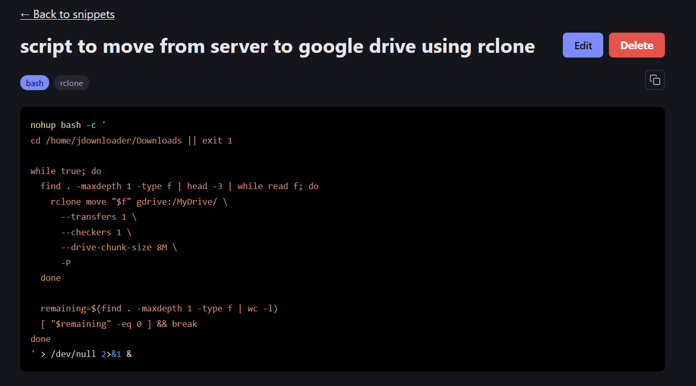

# snippet-memory

snippet-memory is a program that runs on your computer and stores snippets (blocks of codes or text) in its database. You can access it via a browser at your local address or at any address from your LAN. The aim of the program is to provide a simple way of saving text and having it accessible from any device with 1 click.

Some features are:

- Access from any device (ie: laptop, mobile, tv, fridge). As long as your device can open a web page you can have access to all your code blocks or any text you save in the program's database
- No configuration needed. Any device that can run a browser and input the password can read the database or write to it.
- Syntax highlighting: Same as your coding program. When saving a snippet, select the language of the code (like Python or Markdown) and you get syntax highlighting.
- Categories : Sort your snippets into categories like python, powershell. Completely customizable.
- Tagging: Easily search your database using specific tags you assign to your code.
- One click copy button allows for copying the whole text block into clipboard.
- Temporary edit: When you need to change one or a few variables in a code block before copying into the clipboard. This edit will be temporary and will be discarded as soon as you exit the edit section.

 

  
  
  

 

# under the hood

The backend of the program is Go which provides the database interaction and the server. You can change the port in a .json file which is created after the first run. Default port is 8080, meaning you can use the program using 127.0.0.1:8080 in your local system or relevant address in your network ie: 192.168.1.30:8080

The frontend is Typescript which allows it to run on all devices. It is password protected (for now default being 'pass-me-in').

# about that HTTP

In order for the frontend to work on all types of devices, including unconfigured or old devices, I chose not to use HTTPS. Using self-made certificates will defeat the whole purpose of no configuration required, and going to a certificate authority is outside of the scope of my needs.

This app is not intended to be a password storage or be on networks exposed to the internet or public networks. The password limits misuse somewhat but it absolutely is NOT unbreakable as is the nature of HTTP. Keep the program local only and on trusted lan, and it should function as intended, for storing non-secret code blocks or text.

# support

If you find this project helpful consider a [donation](https://github.com/tabclosed/tabclosed). Want to check out other simple but useful programs, check my repository.
